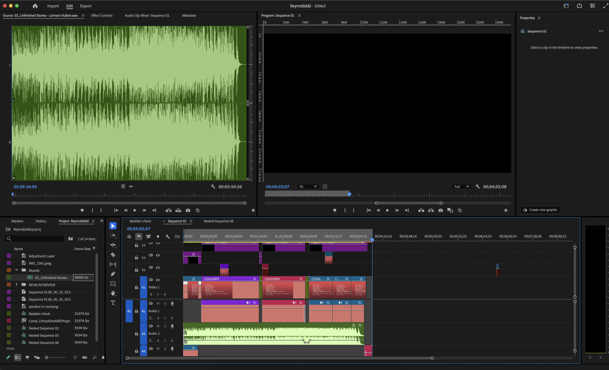
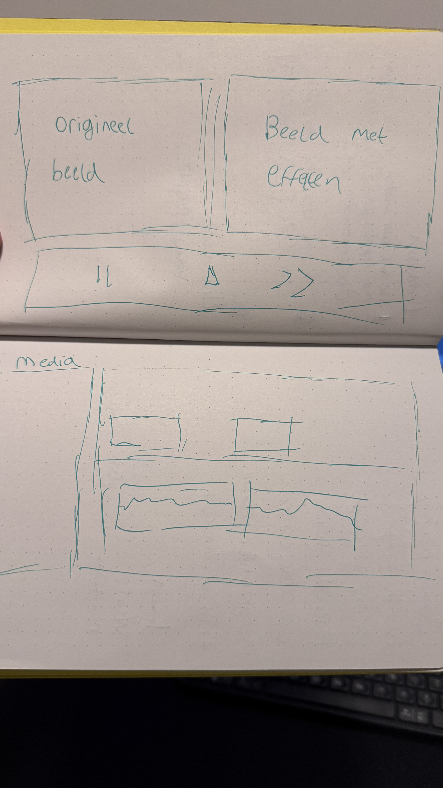
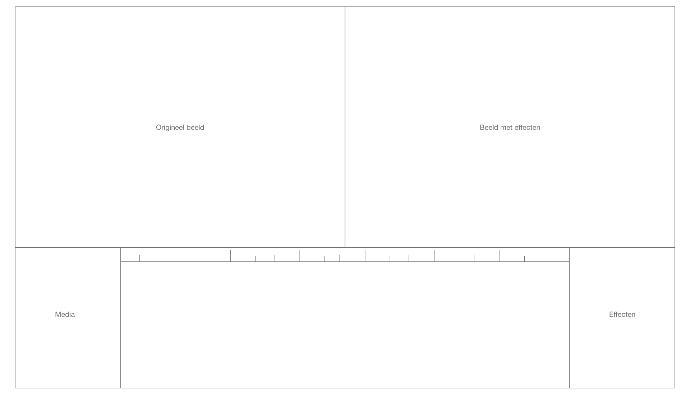
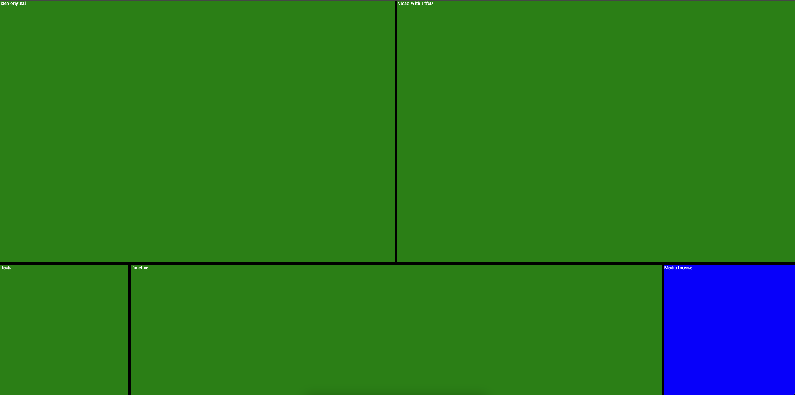

# **Projectoverzicht**

## **Week 1 - Your Plan**

### 🎯 Doelstellingen

1. **Modular control panel**
2. **Online video editor**
3. **Technieken om te verkennen:**
   - Nesting
   - `:has()`
   - Container queries
   - Filters & Masks

### ❓ Uitdagingen

🚀 Interactieve elementen toevoegen zonder JavaScript.  
👨‍💻 Animatie starten en stoppen.

### 📸 Visuals

  
_Dit is een voorbeeld van de interface._

  
_Eerste schets van het ontwerp, met een ruwe indeling van de interface._

  
_Breakdown van de interface, waarin de verschillende componenten worden geanalyseerd._

---

## **Week 2 - Progress**

### 📌 Voortgang


_De eerste layout met css grid._

### ✅ Wat ging goed?

- Eerste ervaring met **CSS Grid**, al was `grid-template` en `grid-area` even wennen.

### ❌ Wat ging minder goed?

- Flexbox geprobeerd, maar **Grid** bleek beter geschikt.

### 💡 Nieuwe inzichten

- **CSS Animaties**:
  ```css
  animation: 2s infinite linear paused;
  animation-play-state: running;
  ```

# **Week 3 - Progress** 🚀

## 📌 Voortgang

Deze week lag de focus op het verbeteren van de lay-out en het verder ontwikkelen van de responsiviteit van mijn project. Ik heb geprobeerd om de container queries verder te implementeren en de interactieve elementen te optimaliseren.


## ✅ Wat ging goed?

- **Nesting:** Ik heb succesvol elementen genest in containers, wat het gemakkelijker maakte om flexibele en herbruikbare componenten te creëren. Dit zorgde voor een schonere structuur in de code.
- **Container Queries:** De container queries werkten zoals verwacht om de lay-out aan te passen op basis van de grootte van de container. Dit maakte het ontwerp responsiever zonder afhankelijk te zijn van de viewportgrootte.
- **Interactiviteit:** De animaties werkten goed, vooral de mogelijkheid om planeten in hun banen te laten draaien op basis van de interactie via de checkbox. Het gedrag was intuïtief en eenvoudig te begrijpen.

## ❌ Wat was uitdagend?

- **Responsiviteit:** Het aanpassen van de lay-out op verschillende schermgroottes bleef een uitdaging. Sommige elementen gaven niet de verwachte resultaten, vooral als de container kleiner werd dan de minimale breedte. Dit zorgde voor een inconsistente weergave op mobiele apparaten.
- **Gebruik van CSS-Variabelen:** Het werkte goed om CSS-variabelen voor dynamische waarden in te stellen, maar het was soms lastig om deze variabelen correct bij te werken binnen animaties. Ik moest extra aandacht besteden aan de timing en de volgorde van de animaties.

## 🔬 Experimenten die ‘faalden’

- **Complexe Flexbox Layouts:** Mijn poging om complexere nested flexbox-lay-outs toe te passen voor responsieve kolommen faalde gedeeltelijk. De elementen gingen niet goed schalen op kleinere schermen. Uiteindelijk moest ik overschakelen op meer gestroomlijnde flexbox-oplossingen om de lay-out stabieler te maken.
- **CSS-Variabelen in @keyframes:** Het gebruik van dynamische variabelen in `@keyframes` werkte niet zoals verwacht. Dit leidde tot onvoorspelbare animaties en moest handmatig worden aangepast.

## 💡 Nieuwe inzichten

- **CSS-Grid en Flexbox:** Ik heb geleerd dat Flexbox uitstekend werkt voor eenvoudige en een-dimensionale lay-outs, maar dat CSS Grid krachtiger is voor complexere, tweedimensionale lay-outs. Dit heeft mijn strategie voor het ontwerp beïnvloed, en ik ben van plan meer CSS Grid toe te passen voor de volgende fase.
- **Container Queries:** De kracht van container queries ligt in het aanpassen van de lay-out op basis van de grootte van de container, niet de viewport. Dit heeft mijn perspectief op responsief ontwerp veranderd, omdat het nu mogelijk is om de stijl van elementen aan te passen zonder te vertrouwen op de algemene schermgrootte.

## 🚀 Uitdagingen voor volgende week

- **Verbeteren van Responsiviteit:** Ik moet nog verder werken aan de algehele responsiviteit van de lay-out, vooral voor kleinere schermformaten. Ik wil ook de implementatie van CSS Grid en container queries verder verkennen om een meer flexibele lay-out te verkrijgen.
- **Optimalisatie van Animaties:** De animaties kunnen nog worden verbeterd, vooral wat betreft het gebruik van dynamische waarden en het verbeteren van de prestaties op mobiele apparaten.
- **Toegankelijkheid:** Ik wil ook beginnen met het verbeteren van de toegankelijkheid van de interactieve elementen, zoals het toevoegen van toetsenbordnavigatie en ondersteuning voor schermlezers.

# **Week 4 - Completion** 🎉

### Eindresultaat

Het eindresultaat is een CSS-gebaseerde lay-out die gebruik maakt van container queries, custom properties (CSS-variabelen) en animaties om een interactieve en dynamische ervaring te creëren. Het doel was om een systeem te ontwerpen waarbij elementen (zoals planeten) op een gestileerde manier in een baan draaien, waarbij moderne CSS-technieken zoals container queries en custom media queries voor responsive design worden gebruikt.

#### Wat Ging Goed:

- **Flexbox Lay-outs:** Flexbox werkte zoals verwacht voor de algemene lay-out, waardoor het eenvoudig was om items in een container uit te lijnen.
- **CSS-Variabelen:** Het gebruik van CSS-variabelen voor kleuren, animatiesnelheden en maten maakte het mogelijk om snel aanpassingen te doen en de styling dynamischer te maken. Dit maakte het gemakkelijker om ontwerpparameters en responsiviteit aan te passen.
- **Basisanimaties:** De `@keyframes` voor het creëren van draaiende planeten met vloeiende overgangen werkten goed, waarbij de animatie werd geactiveerd en gepauzeerd op basis van interactie via de checkbox.

#### Wat Was Uitdagend:

- **Container Queries:** De grootste uitdaging was het werkend krijgen van de container queries (`@container`). Aanvankelijk overzag ik het feit dat de `container-type` eigenschap op het bovenliggende element ingesteld moest worden, wat ervoor zorgde dat de container queries niet getriggerd werden.
- **CSS-Variabelen in Animaties:** Het proberen om dynamische CSS-variabelen (zoals `--angle` voor rotatie) te gebruiken binnen animaties was lastig, omdat dit zorgde voor het correct bijwerken van de waarden tijdens de animatiecyclus.
- **Interactie tussen Viewport en Container Queries:** Ik had moeite om ervoor te zorgen dat de container queries correct reageerden op zowel de viewport als de grootte van de sectie zelf. Dit vereiste meerdere benaderingen om te testen hoe de bovenliggende elementen zich aanpassen en hoe deze veranderingen zich reflecteren op de onderliggende elementen.

#### Waar Ik Het Meest Trots Op Ben:

- **Vloeiende Interactiviteit:** De mogelijkheid om animaties te besturen op basis van gebruikersinvoer (de checkbox) is een functie waar ik trots op ben. Door animaties te pauzeren en te hervatten met alleen CSS, creëerde ik een interactieve ervaring zonder JavaScript.
- **Gebruik van Container Queries:** Het implementeren van container queries om de schaal van elementen aan te passen op basis van de breedte van de container was een spannende uitdaging en een belangrijke leerervaring.

#### Mislukte Experimenten:

- **Gradient Overgangen:** In eerste instantie probeerde ik een gradient (`light-dark`) te gebruiken voor het overgaan tussen lichte en donkere modus, maar ik stuitte op compatibiliteitsproblemen tussen browsers. De syntaxis werkte niet zoals verwacht, dus moest ik terugvallen op eenvoudigere `--eerste-kleur-zon` en `--tweede-kleur-zon` voor die overgangen.
- **Complexe Media Query Interacties:** Ik verkende manieren om lay-out eigenschappen aan te passen met behulp van zowel viewport-gebaseerde media queries als container queries samen. Ik kwam echter in de problemen met conflicterende gedragingen toen beide werden gecombineerd. Het werd duidelijk dat deze beter gescheiden moesten worden voor meer controle.

#### Nieuwe Inzichten in de Kracht van CSS:

- **Container Queries Zijn Krachtig:** De mogelijkheid om stijlen aan te passen op basis van de grootte van de bovenliggende container opent nieuwe mogelijkheden voor responsieve ontwerpen zonder alleen afhankelijk te zijn van de viewportgrootte. Dit maakt het ontwerp meer modulair en aanpasbaar.
- **CSS-Variabelen voor Dynamische Inhoud:** Het gebruik van CSS-variabelen voor herbruikbare stijlen (zoals snelheid, grootte, kleuren) bood veel flexibiliteit. Deze kunnen worden bijgewerkt door gebruikersinteracties of op basis van container queries, wat het ontwerp interactiever en beter onderhoudbaar maakt.

#### Wat Ik Verder Wil Verkennen:

- **Integratie van JavaScript en CSS:** Hoewel ik JavaScript vermijd voor de meeste interacties, zou het interessant zijn om te verkennen hoe JavaScript CSS-gebaseerde animaties en interacties kan versterken, vooral voor complexere scenario's.
- **Meer Geavanceerde CSS Animaties:** Ik wil dieper duiken in meer geavanceerde CSS-animatietechnieken, zoals keyframe-gebaseerde bewegingen en overgangen, om nog meer leven in de animaties te brengen.
- **Toegankelijkheid met CSS:** Zorgen voor toegankelijke interactieve elementen (zoals checkboxes en schuifregelaars) is een uitdaging die ik verder wil aanpakken, inclusief het verbeteren van navigatie via toetsenbord en ondersteuning voor schermlezers.

## Bronnenlijst

https://www.w3schools.com/css/css_grid.asp
https://developer.mozilla.org/en-US/docs/Web/CSS/CSS_containment/Container_queries?utm_source=chatgpt.com
https://webdesign.tutsplus.com/how-to-use-css-variables-for-animation--cms-28868t?utm_source=chatgpt.com
https://pixabay.com/nl/photos/aarde-planeet-de-ruimte-wereld-11009/

https://pixabay.com/nl/photos/mars-rode-planeet-planeet-de-ruimte-11012/
https://pixabay.com/nl/photos/venus-oppervlakte-heet-warmte-11022/
https://en.wikipedia.org/wiki/Mercury_(planet)
https://codepen.io/web-dot-dev/pen/VwoBQjY

### Code (Voorbeeld)

```css
@container (max-width: 300px) {
  section {
    --scale: 0.5; /* Schaal naar 0.5 wanneer de breedte van de sectie kleiner is dan 300px */
  }
}

@container (min-width: 300px) {
  section {
    --scale: 1; /* Zet terug naar 1 wanneer de breedte van de sectie 300px of groter is */
  }
}

section {
  transform: scale(var(--scale, 1)); /* Pas schaaltransformatie toe */
  transition: transform 0.3s ease-in-out;
}
```
